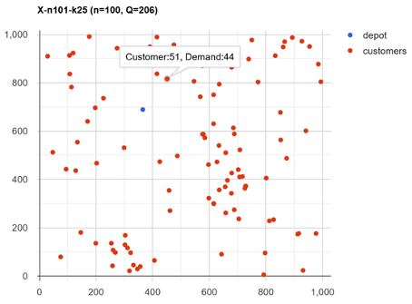
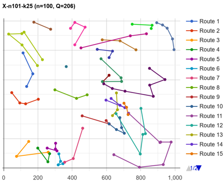

# CVRP

## Introduction aux VRP

Les problèmes de tournées de véhicules ou **Vehicle Routing Problem** sont des problèmes d’optimisation combinatoire complexes et trouvant de nombreuses applications dans le secteur industriel, plus particulièrement en logistique. Les VRP sont une combinaison de contraintes d’allocation de ressources (répartition de la charge dans les véhicules) et de construction de séquence. La difficulté étant que dans l’industrie ces problèmes prennent rapidement une dimension gigantesque d’où l’intérêt d’avoir des heuristiques pour les résoudre.

### Contexte des problèmes CVRP

L'objectif de ce projet est d'implémenter des méthodes approchées permettant de résoudre un problème de planification de tournées de véhicules.

Il s'agit des problèmes de type CVRP : **_Capacited Vehicle Routing Problem_**. Notre entreprise de livraison dispose d'une flotte de camions avec une capacité limitée. Nous avons un ensemble de clients à desservir en partant d'un point de départ : le dépôt de notre entreprise. Nous connaissons la localisation de chacun des clients dans la section NODE_COORD_SECTION du fichier vrp qui sera présenté dans la partie b). Chaque demande d'un client représente une quantité qu'il faut livrer du dépôt à la localisation du client. Le but est donc de planifier les tournées des véhicules afin de minimiser la somme des distances parcourues (temps de transport). 
**Fonction objectif** : “minimiser la somme des trajets réalisés” 
Il est nécessaire de respecter :

- la contrainte de capacité des camions
- la contrainte qui impose de satisfaire tous les clients

Il faut donc trouver les chemins les plus courts pour organiser la tournée en respectant les contraintes de capacités. 

### Comprendre le format des jeux de données

Une instance est un problème défini par un ensemble de clients et leur demande associée à satisfaire. De nombreux types d’instances ont été créés au cours des années et sont disponibles sur le site de "CVRP LIB - All instances” :
Lien : <a href="http://vrp.galgos.inf.puc-rio.br/index.php/en/">CVRPLIB<a/>

Pour chaque instance, nous pouvons avoir accès à une visualisation graphique modélisant le problème “Plotted Instance”, au fichier vrp et à un fichier solution.

En sélectionnant une <a href="http://vrp.galgos.inf.puc-rio.br/index.php/en/plotted-instances?data=X-n120-k6">Instance<a/>, plusieurs informations sont directement affichées :

Notamment, on peut afficher la meilleure solution trouvée à l'heure actuelle, potentiellement la solution optimale dans le cas où la colonne _Opt_ est inscrite "yes"

